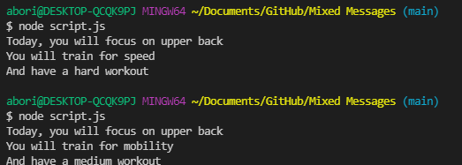

# Mixed Messages
> A workout themed message generator program.

## Table of Contents
* [General Info](#general-information)
* [Technologies Used](#technologies-used)
* [Features](#features)
* [Setup](#setup)
* [Usage](#usage)
* [Project Status](#project-status)
* [Room for Improvement](#room-for-improvement)
* [Acknowledgements](#acknowledgements)
* [Contact](#contact)

## General Information
Every time the user runs the program, they should get a new randomized output.


## Technologies Used
- Node.js - version 14.16.0


## Features
- Print a random workout for you.

## Screenshots


## Setup
Install Node.js
Run this command in the terminal
```
node script.js
```

## Usage
Simply run the script and a generated message will print on the terminal.


## Project Status
Project is: _complete_.


## Room for Improvement
Room for improvement:
- Create a console to register commands such as add message, delete message to print customized messages.

## Acknowledgements
Give credit here.
- This project was inspired by...codecademy


## Contact
Created by Boris Pavel - feel free to contact me!


